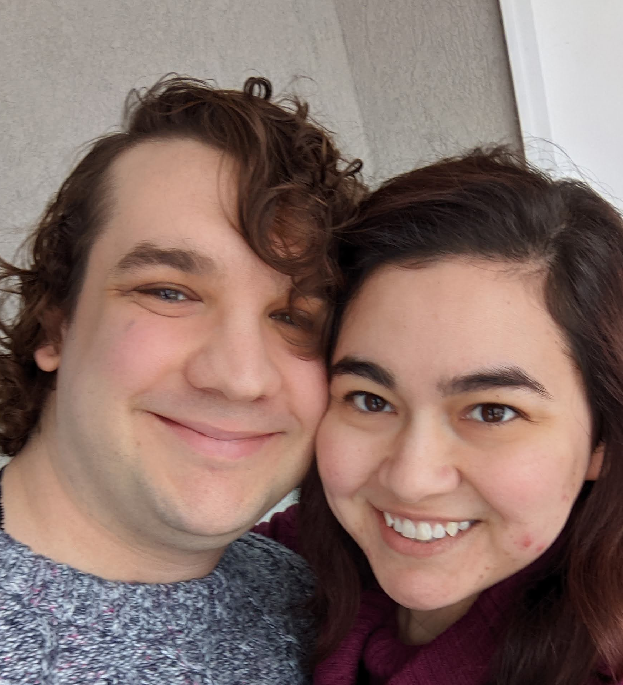

Dakota Brown (any pronouns)
==

About Me
--

I am a (primarily Python) developer in northern Utah. I got my start as a high-school teacher in California, but found my love for technology to be a more fulfilling career. Now, I enjoy work where I can make neat things and help out those who need it.

Experience History
--

I started my career in software working for a SaaS company based here in Ogden. They were looking for an IT expert, but got me instead. I quickly rose to the rank of senior developer there and helped them modernize a PHP application that was in desperate need of some TLC.

After about a year and half there, I was picked up by Worthy Financial. I worked with them November of 2019 through April of 2021. There, I used Python and the Flask web framework to deploy an API on the AWS Lambda service. Their product helps regular people make smart investments with a solid return, while also providing capital for small business loans issued throughout the country.

Currently, I am working as a Site Reliability Engineer for the Sling team at DISH Networks. I am helping them modernize their pipelines, ensure downtime is nigh non-existent, and assist the development teams wherever needed.

Hobbies
--

Obviously, I love writing code. I would put more on here if only I had the time. However, that's neither here nor there and I have other interests, too. These include:

* Coffee making (pour-over is best method, and I'll fight you on that)
* Playing Animal Crossing and Zelda
* Hanging out with my partner
* Wondering how our children have that much energy
* Being bewildered by the amount of things that the children never play with are out of their respective homes
* Making and drinking more coffee (to deal with said children without losing my mind)

Goals
--

Ultimately, I want to retire in Washington or Oregon with my partner. We can buy a tiny home and operate a coffee shop of our own. Before then, though, I would also like to move my way up to CTO somewhere, make something that truly changes at least one person's life, and discover the secret to cooking more than just pasta and HelloFresh recipes.
